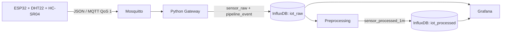

# Bài thực hành số 2 - Pipeline dữ liệu IoT

Dự án xây dựng đầy đủ pipeline thu thập, lưu trữ, tiền xử lý và giám sát dữ liệu IoT theo yêu cầu Bài thực hành số 2 của học phần **IoT và Ứng dụng (INT14149)**.



## 1. Nội dung bàn giao

| Yêu cầu đề bài | Vị trí trong repository |
|---|---|
| Firmware thiết bị nhúng | `firmware/` |
| Script thu thập và ghi dữ liệu | `gateway/` |
| Script tiền xử lý | `processing/preprocess.py` |
| File cấu hình | `.env.example`, `infra/`, `firmware/platformio.ini` |
| README hướng dẫn chạy | `README.md` |
| App ứng dụng | Dashboard Grafana trong `infra/grafana/` |
| Báo cáo Word 4-6 trang | `docs/Bao_cao_Bai_2_IoT_hoan_chinh.docx` |

Các thư mục `tools/` và `tests/` hỗ trợ tạo dữ liệu demo, kiểm thử lỗi và xác minh chất lượng mã nguồn.

## 2. Cấu trúc thư mục

```text
IoT_Lab2_Submission/
├── firmware/                  # ESP32, Wokwi và PlatformIO
│   ├── src/main.cpp
│   ├── sketch.ino
│   ├── diagram.json
│   ├── platformio.ini
│   └── wokwi.toml
├── gateway/                   # MQTT subscriber, validation, InfluxDB writer
├── processing/                # Làm sạch, outlier, resampling, feature engineering
├── infra/                     # Docker Compose, Mosquitto, InfluxDB, Grafana
├── tools/                     # Publisher kiểm thử và bộ sinh dữ liệu demo
├── tests/                     # 36 trường hợp kiểm thử tự động
├── docs/                      # Báo cáo Word
├── .env.example               # Mẫu cấu hình, không chứa secret thật
├── requirements.txt
└── README.md
```

## 3. Thành phần và luồng dữ liệu

- ESP32 đọc `temperature_c`, `humidity_pct` từ DHT22 và `distance_cm` từ HC-SR04 mỗi 5 giây.
- Firmware publish JSON lên topic `iot/lab2/esp32-01/telemetry`.
- Gateway subscribe `iot/lab2/+/telemetry` với QoS 1, validate payload, phát hiện duplicate/sequence gap, tính latency và ghi InfluxDB.
- Chương trình preprocessing đọc dữ liệu raw theo khoảng thời gian, sửa lỗi ngắn hạn, resample theo phút và tạo đặc trưng.
- Grafana hiển thị dữ liệu thời gian thực, dữ liệu đã xử lý, latency p95 và số mẫu hợp lệ.

Payload mẫu:

```json
{
  "schema_version": 1,
  "device_id": "esp32-01",
  "boot_id": "00C40A249846459B",
  "sequence": 18,
  "sent_at_ms": 1790667924444,
  "temperature_c": 25.0,
  "humidity_pct": 50.0,
  "distance_cm": 100.82,
  "rssi_dbm": -91,
  "uptime_s": 10,
  "led_on": false
}
```

## 4. Yêu cầu môi trường

- Docker Desktop có Docker Compose v2.
- Python 3.11 trở lên.
- VS Code với extension PlatformIO IDE và Wokwi Simulator.
- Windows PowerShell được dùng trong các lệnh minh họa. Trên Linux/macOS, dùng lệnh tương đương để tạo virtual environment.

## 5. Cài đặt Python và cấu hình

Tại thư mục gốc của repository:

```powershell
Copy-Item .env.example .env
python -m venv .venv
Set-ExecutionPolicy -Scope Process Bypass
.\.venv\Scripts\Activate.ps1
python -m pip install --upgrade pip
python -m pip install -r requirements.txt
```

`.env.example` chỉ chứa giá trị mẫu. Trước khi triển khai ngoài máy cá nhân, phải thay `INFLUX_PASSWORD`, `INFLUX_TOKEN` và `GRAFANA_ADMIN_PASSWORD`. File `.env` đã được loại khỏi Git bằng `.gitignore`.

## 6. Khởi động Mosquitto, InfluxDB và Grafana

Mở Docker Desktop rồi chạy:

```powershell
docker compose --env-file .env -f infra/compose.yaml up -d
docker compose --env-file .env -f infra/compose.yaml ps
```

Các dịch vụ chỉ bind vào localhost theo mặc định:

| Dịch vụ | Địa chỉ |
|---|---|
| MQTT Mosquitto | `127.0.0.1:1884` |
| InfluxDB | <http://127.0.0.1:8086> |
| Grafana | <http://127.0.0.1:3000> |

Tài khoản InfluxDB và Grafana lấy từ file `.env` vừa tạo. Mosquitto cho phép anonymous chỉ để phục vụ bài lab cục bộ; không expose cấu hình này ra Internet.

## 7. Chạy chương trình thu thập và ghi dữ liệu

Mở PowerShell thứ hai tại thư mục gốc:

```powershell
.\.venv\Scripts\Activate.ps1
python -m gateway
```

Gateway thực hiện các kiểm tra chính:

- `temperature_c`: từ -40 đến 80 °C.
- `humidity_pct`: từ 0 đến 100%.
- `distance_cm`: từ 2 đến 400 cm.
- `device_id` phải khớp với topic.
- Timestamp không được cũ hơn mốc năm 2020 hoặc vượt quá 5 phút trong tương lai.
- Duplicate được nhận diện bởi `(device_id, boot_id, sequence)`.
- Sequence gap và out-of-order được ghi vào measurement `pipeline_event`.

## 8. Build và chạy firmware ESP32 trên Wokwi

Build firmware:

```powershell
cd firmware
.\build.ps1
```

Sau đó mở riêng thư mục `firmware/` bằng VS Code:

1. Chọn **Wokwi: Enable Private IoT Gateway**.
2. Chọn **Wokwi: Start Simulator**.
3. Mở Wokwi Serial Monitor ở 115200 baud.

Sơ đồ chân:

| Thiết bị | Chân ESP32 |
|---|---|
| DHT22 DATA | GPIO15 |
| HC-SR04 TRIG | GPIO5 |
| HC-SR04 ECHO | GPIO18 |
| LED qua điện trở 220 Ω | GPIO2 |

Wokwi truy cập broker trên máy host qua `host.wokwi.internal:1884`. Gateway Python trên máy tính dùng `127.0.0.1:1884`.

## 9. Thiết kế lưu trữ InfluxDB

| Bucket | Measurement | Retention | Nội dung |
|---|---|---:|---|
| `iot_raw` | `sensor_raw` | 30 ngày | Dữ liệu cảm biến hợp lệ và latency |
| `iot_raw` | `pipeline_event` | 30 ngày | Gap, duplicate, out-of-order, payload lỗi |
| `iot_processed` | `sensor_processed_1m` | 180 ngày | Dữ liệu resample và đặc trưng |

Các tag gồm `device_id`, `location`, `schema_version`. Giá trị cảm biến, sequence, latency và đặc trưng là field để tránh tăng cardinality không cần thiết.

## 10. Chạy tiền xử lý

Chạy một lần cho hai giờ gần nhất:

```powershell
python -m processing.preprocess --lookback=-2h
```

Hoặc chạy lặp mỗi 60 giây:

```powershell
python -m processing.preprocess --lookback=-2h --watch --interval 60
```

Pipeline tiền xử lý gồm:

1. Chuẩn hóa thời gian, sắp xếp và bỏ bản ghi trùng.
2. Phát hiện outlier bằng IQR với hệ số 1,5.
3. Nội suy theo thời gian tối đa hai khoảng liên tiếp.
4. Resampling theo cửa sổ 1 phút.
5. Tạo rolling mean 5 phút, delta, Z-score, `sample_count`, `missing_count` và `outlier_count`.
6. Ghi kết quả idempotent vào `sensor_processed_1m`.

## 11. Tạo dữ liệu demo và kiểm thử lỗi

Nếu chưa chạy Wokwi, có thể kiểm tra toàn bộ backend bằng publisher mẫu:

```powershell
python tools/publish_sample.py --count 12 --include-anomalies
```

Tùy chọn `--include-anomalies` tạo một sequence gap, một duplicate và một payload có độ ẩm ngoài phạm vi.

Tạo 90 phút dữ liệu đa dạng cho InfluxDB/Grafana:

```powershell
python tools/seed_demo_data.py --minutes 90
python -m processing.preprocess --lookback=-2h
```

## 12. Dashboard Grafana

Docker Compose tự provision dashboard:

```text
IoT Lab 2 / IoT Lab 2 - Telemetry Pipeline
```

Dashboard gồm:

- Nhiệt độ raw và rolling mean 5 phút.
- Độ ẩm và khoảng cách.
- Latency p95 và latency theo thời gian.
- Tổng số mẫu hợp lệ.

Nếu dashboard chưa có dữ liệu, kiểm tra gateway đang chạy, chọn time range chứa dữ liệu và chạy preprocessing ít nhất một lần.

## 13. Kiểm thử và kiểm tra cấu hình

```powershell
python -m pytest -q
python -m compileall -q gateway processing tools tests
docker compose --env-file .env -f infra/compose.yaml config --quiet
```

Kết quả chuẩn của phiên bản bàn giao: **36 test passed**.

Checklist demo:

- Ba container Mosquitto, InfluxDB và Grafana ở trạng thái healthy.
- Firmware báo kết nối Wi-Fi, MQTT và publish thành công.
- Gateway nhận dữ liệu liên tục và ghi `sensor_raw`.
- Payload sai bị từ chối; duplicate không tạo thêm raw point; sequence gap được ghi event.
- `sensor_processed_1m` có dữ liệu sau khi chạy preprocessing.
- Dashboard hiển thị được cả raw, processed và latency.

## 14. Dừng hệ thống

```powershell
docker compose --env-file .env -f infra/compose.yaml down
```

Lệnh trên giữ nguyên Docker volumes. Chỉ dùng `down --volumes` khi thực sự muốn xóa toàn bộ dữ liệu của bài lab.

## 15. Xử lý lỗi thường gặp

| Hiện tượng | Cách xử lý |
|---|---|
| Wokwi không kết nối MQTT | Bật Private IoT Gateway; dùng `host.wokwi.internal:1884`, không dùng `localhost` trong firmware |
| Gateway báo thiếu token | Tạo `.env` từ `.env.example` và điền `INFLUX_TOKEN` |
| InfluxDB Data Explorer không hiện dữ liệu | Chọn đúng bucket, measurement, field và time range |
| Grafana hiện `No data` | Chạy gateway/publisher, chạy preprocessing và chọn đúng khoảng thời gian |
| Build ESP32 lỗi | Kiểm tra PlatformIO và chạy `firmware/build.ps1` ngay trong thư mục firmware |

